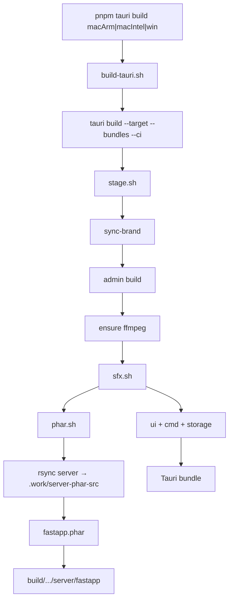

# 桌面打包链路

> 改打包脚本前读本节。构建命令与交叉编译见 [desktop/README.md](../desktop/README.md#构建)；运行时见 [desktop/README.md#运行时](../desktop/README.md#运行时)。

桌面安装包含 **UI + 业务 + storage 静态资源**（`ui`、`server/fastapp`、`cmd/ffmpeg`、`storage/languages`、`storage/ttc`）。`tools/` 不进包。**打包全程不修改 `server/` 源码。**

## 管线

中间产物在 `desktop/build/<platform>/`（由 `pnpm tauri build <平台>` 经 [`build-tauri.sh`](../desktop/scripts/build-tauri.sh) 设置 `DESKTOP_PKG_PLATFORM`，见 [`platform.sh`](../desktop/scripts/lib/platform.sh)）。



| 步骤 | 产物 |
|------|------|
| sync-brand | icons / tauri.conf / splash |
| phar | `build/<platform>/.work/fastapp.phar` |
| sfx | `build/<platform>/server/fastapp` |
| bundle | `build/<platform>/{ui,cmd,storage}` |
| tauri | `src-tauri/target/<triple>/release/bundle/` |

单步调试：`bash desktop/scripts/desktop.sh phar|sfx|stage`（无平台参数时用当前主机架构，输出到 `build/` 而非 `build/<platform>/`）。

## 步骤

**sync-brand** — 读取 [`brand.json`](../desktop/brand.json)，同步 `name`/`identifier`/`logo`/`dataDir` 到 Tauri 配置、启动页、图标与 Rust `APP_DATA_DIR`。

**phar** — [`phar.sh`](../desktop/scripts/phar.sh) + [`phar-mirror.sh`](../desktop/scripts/lib/phar-mirror.sh)：rsync `server/` → `build/.work/server-phar-src/`（exclude：`storage`、`runtime`、插件 `Database`/`docs`/`web`），系统 `php` 在镜像内 `phar:build`；stamp `install.lock`；**不触碰源码 `server/`**。

```text
build/.work/
├── server-phar-src/   # phar 镜像（每次重建）
└── fastapp.phar
```

**sfx** — [`sfx.sh`](../desktop/scripts/sfx.sh)：swoole-cli + phar → `copy + append + pack('J', phar_size)`；Windows 另复制 runtime dll。

**stage bundle** — rsync `admin/dist` → `build/ui`；复制 ffmpeg → `build/cmd`；rsync `server/storage/{languages,ttc}` → `build/storage`（不含 uploads、sqlite）。

平台二进制（ffmpeg 自动下载、swoole 预编译目录）见 [`desktop/cmd/README.md`](../desktop/cmd/README.md)。

## 环境变量

| 变量 | 用途 |
|------|------|
| `DESKTOP_PKG_PLATFORM` | `build-tauri.sh` 设置，决定 `build/<platform>/` 与 stage 二进制架构 |
| `DESKTOP_SKIP_ADMIN` | 跳过 admin build |
| `DESKTOP_FORCE_PHAR` | 强制重建 phar |
| `DESKTOP_KEEP_PHAR` | sfx 后保留 phar |
| `DESKTOP_FFMPEG_MIRROR=china` | ffmpeg 国内镜像 |
| `DESKTOP_BUILD_DIR` | 覆盖 stage 输出目录 |

## 关键文件

| 用途 | 路径 |
|------|------|
| 品牌配置 | `desktop/brand.json` |
| 打包入口 | `desktop/scripts/tauri.sh`、`desktop/scripts/build-tauri.sh` |
| 编排入口 | `desktop/scripts/stage.sh`、`desktop/scripts/desktop.sh` |
| 平台映射 | `desktop/scripts/lib/platform.sh` |
| phar 镜像 | `desktop/scripts/lib/phar-mirror.sh` |
| CDN 发布 | `desktop/scripts/publish-cdn.sh` |
| 运行时启停 | `desktop/src-tauri/src/process/hyperf.rs` |

脚本与 lib 索引见 [desktop/scripts/README.md](../desktop/scripts/README.md)。
