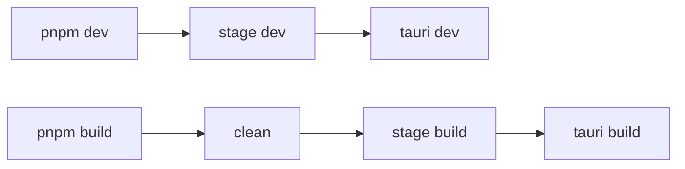

# Desktop 壳

Tauri 桌面壳 + admin UI + 单文件 `fastapp`（Hyperf SFX）。桌面壳配置统一在 `[src-tauri/tauri.conf.json](src-tauri/tauri.conf.json)`（`productName`、`identifier`、`plugins.desktop` 段）。支持 **macOS**、**Windows x64**。

## 快速开始

```bash
cd desktop && pnpm install

pnpm dev                  # stage dev → tauri dev
pnpm build macArm         # clean → stage build → tauri build（.app + .dmg）
pnpm build macIntel
pnpm build win            # NSIS
```

改 admin / server 或需全量重建：`DESKTOP_FORCE=1 pnpm dev`

**打包前必备**

- `[server/.env](../server/.env)`：打 phar 时打入 `fastapp`；`APP_PORT`/`APP_WS_PORT` 由 stage 同步到 `tauri.conf.json` 的 `plugins.desktop.appPort`/`appWsPort`
- `server/storage/fastapp.sqlite`
- 普惠体字体文件（见下方「字体」）
- `ffmpeg` / `swoole-cli`：见 [cmd/README.md](cmd/README.md)


## 配置（`tauri.conf.json`）

手改字段：


| 字段                        | 说明                                      |
| ------------------------- | --------------------------------------- |
| `productName`             | 产品名；stage 同步到窗口标题、splash、admin `VITE_APP_TITLE` |
| `mainBinaryName`          | 主二进制文件名（stage 由 `productName` 自动写入，勿手改） |
| `identifier`              | Tauri bundle identifier                 |
| `app.windows[].dragDropEnabled` | 须为 `false`：默认原生文件拖放会拦截 HTML5 DnD（资源库拖入画布） |
| `plugins.desktop.dataDir` | AppData 目录名                             |
| `plugins.desktop.logo`    | 图标源图（相对 `desktop/`）；stage 生成 Tauri icons 并同步 admin logo/favicon |


stage 自动写入（来自 `server/.env`）：


| 字段                          | 说明                      |
| --------------------------- | ----------------------- |
| `plugins.desktop.appPort`   | HTTP 端口（Tauri navigate） |
| `plugins.desktop.appWsPort` | WebSocket 端口            |
| `bundle.resources`          | 按平台重写                   |
| `app.windows[].title`       | 与 `productName` 同步（stage 自动） |
| admin `VITE_APP_TITLE` / `VITE_APP_LOGO` | 桌面构建时由 stage 从 `productName` / `logo` 注入 |


改端口：改 `server/.env` 后 `pnpm dev`（stage 同步 tauri.conf）；若 fastapp 已存在需 `DESKTOP_FORCE=1` 重建 phar。

改产品名或 logo：只改 `tauri.conf.json` 的 `productName` / `plugins.desktop.logo`，然后 `DESKTOP_FORCE=1 pnpm dev` 重建 icons 与 admin UI。内部 Hyperf 子进程仍名为 `fastapp`（SFX 实现细节，不在 Dock/Cmd+Tab 显示）。

## 运行时


| 层              | 职责                                                                  |
| -------------- | ------------------------------------------------------------------- |
| **Tauri**      | splash、`install_bundled`、启动 Hyperf、打开 `http://127.0.0.1:{appPort}/` |
| **Hyperf SFX** | API + 静态托管 `AppData/ui/`                                            |
| **admin**      | `VITE_APP_ROOT_BASE=/`                                              |


`fastapp` 为 swoole-cli SFX；Hyperf 命令须 `--self`，不要传 `bin/hyperf.php`。

AppData：`macOS` `~/Library/Application Support/<dataDir>/`；`Windows` `%APPDATA%/<dataDir>/`（`dataDir` 见 `tauri.conf.json` → `plugins.desktop.dataDir`）。

```
<dataDir>/
├── fastapp           # .env 在 phar 内
├── storage/          # sqlite、languages、uploads
├── ui/               # admin dist（含 font/alibaba-pu-hui-ti-3/）
├── cmd/              # ffmpeg、ffprobe
├── runtime/
└── logs/
```

`ui/`、`storage/`、`cmd/` 路径由 PHP `disk_root()` 推导；Hyperf 配置在 phar 内 `.env`（构建时从 `server/.env` 打入 phar）。


| 场景               | `install_bundled` 行为                                                       |
| ---------------- | -------------------------------------------------------------------------- |
| `tauri dev` 且已安装 | 每次刷新 `fastapp`、`ui/`、`cmd/`；**不覆盖** `storage/`（仅补缺失子项）                     |
| 安装包首次启动          | 复制 `fastapp`、`ui/`、`cmd/`；`storage` 按项 seed（sqlite、languages、空 `uploads/`） |
| 安装包再次启动          | 跳过（仅补全缺失的 storage 子项）                                                      |


## 构建

bundled 先于 Tauri 壳构建（`[tauri.sh](scripts/tauri.sh)` 串行调用 `[stage.sh](scripts/stage.sh)`，不用 `tauri.conf` 钩子）。




**stage 四步**：`tauri-conf` → `ui` → `runtime`（mirror → `phar:build` → fastapp SFX）→ `data`

`runtime` 在 `build/<platform>/.work/` 镜像 `server/`（排除 `storage`/`runtime`/`tests` 及插件内 `web`/`docs`/`database`），在镜像目录执行 `phar:build`，再经 swoole-cli 打成单文件 `fastapp`。桌面 UI 只走 `admin` → `ui/`，不进 phar。`storage/uploads` 仅空目录，不打包上传内容。

| profile                  | 行为                                                           |
| ------------------------ | ------------------------------------------------------------ |
| `dev`                    | 产物缺失才构建/同步；tauri-conf 每次执行；重建 admin 仅清 `admin/dist` |
| `build`                  | 全量重建（`desktop_clean_all`：`admin/dist`、`build/`、遗留 `bundle/`、`src-tauri/target/`） |
| `DESKTOP_FORCE=1`（仅 dev） | 强制重建 admin、phar、data、icons                                   |


门控函数与 lib 模块见 [scripts/README.md](scripts/README.md)。`scripts/lib/` 分三层：`core/`（路径、平台、门控、clean、branding）、`stage/`（四步实现，按需加载）、`vendor/`（ffmpeg、swoole、pack-sfx）。

`bundle.resources` 由 stage 写入，其余 `tauri.conf.json` 字段可手改。

### 环境变量


| 变量                            | 用途                           |
| ----------------------------- | ---------------------------- |
| `DESKTOP_PKG_PLATFORM`        | `macArm`                     |
| `DESKTOP_STAGE_PROFILE`       | `stage.sh` 参数：`dev`          |
| `DESKTOP_FORCE=1`             | dev 下强制全量 stage              |
| `DESKTOP_KEEP_PHAR`           | sfx 后保留 `.work/fastapp.phar` |
| `DESKTOP_FFMPEG_MIRROR=china` | ffmpeg 国内镜像                  |
| `DESKTOP_BUILD_DIR`           | 覆盖 stage 输出目录                |
| `DESKTOP_OPEN_AFTER_BUILD`    | 打包成功后 `open` 安装包             |


### 调试

- 日志：`~/Library/Application Support/StoryStudio/logs/desktop.log`、`runtime/hyperf.log`
- Inspect 过滤 `[bridge]`、`[editor:`；改前端后 `DESKTOP_FORCE=1 pnpm dev`
- 画布穿透 / 拖入约定：[`编辑器数据双向穿透链路.md`](../../server/plugin/ds/storyStudio/docs/code/编辑器数据双向穿透链路.md)（§6.2）

**stage 单步**

```bash
bash scripts/stage.sh dev
bash scripts/stage.sh build
source scripts/lib/common.sh && desktop_init
source scripts/lib/stage/phar.sh && desktop_build_phar
source scripts/lib/stage/runtime.sh && desktop_build_sfx   # 复用已有 phar 时需 DESKTOP_FORCE=1
```


## 字体

Web DOM + FFmpeg + Phaser MSDF 说明与 **手动下载地址**：[admin/public/font/alibaba-pu-hui-ti-3/README.md](../admin/public/font/alibaba-pu-hui-ti-3/README.md)

- **Web**：4 语种 × 3 字重 woff2（Regular / Medium / Bold），统一 `@font-face` → [`admin/src/assets/styles/resources/fonts.scss`](../admin/src/assets/styles/resources/fonts.scss)
- **FFmpeg**：每语种 `{locale}-regular.otf`
- **Phaser MSDF**：`admin/public/font/bitmap/`（`node scripts/font/gen-bitmap-font.mjs`）
- **校验**：`desktop/scripts/lib/stage/fonts.sh`（stage / `pnpm dev` 时提示缺失）


## 构建环境

Node + pnpm、Rust、`PHP 8.1+`；macOS 另需 Xcode CLT。交叉编译 Windows：`rustup target add x86_64-pc-windows-msvc`；macOS 打 win 需 `mingw-w64` 或 `cargo-xwin`。

脚本索引：[scripts/README.md](scripts/README.md)