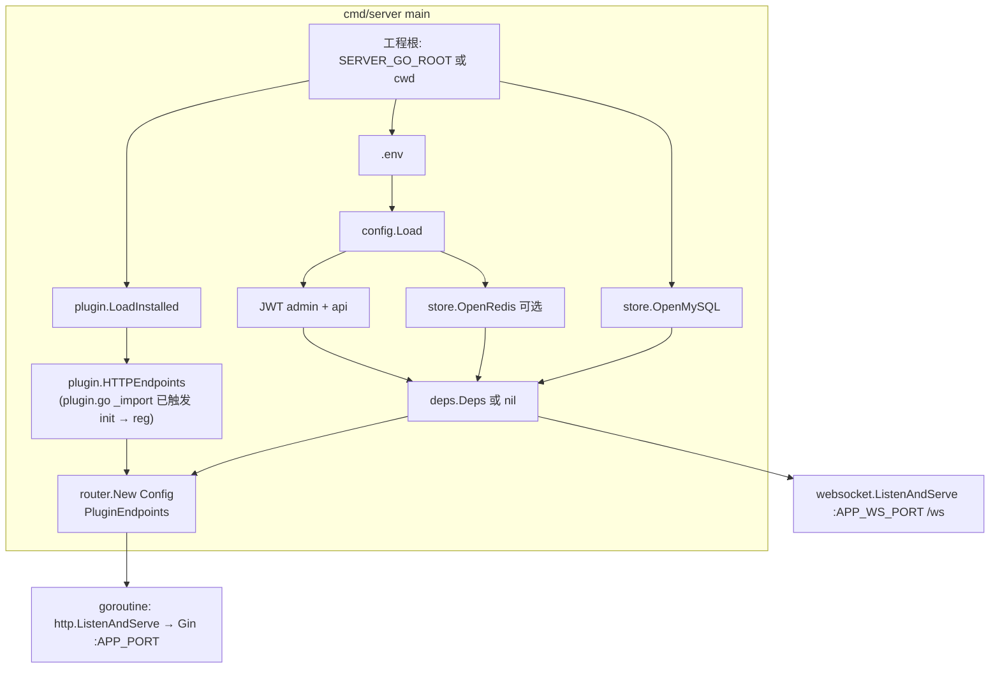

# 核心功能与架构

## 设计取向

| 维度 | 说明 |
|------|------|
| **JSON 契约** | URL、Query/Body、响应体字段约定统一，便于 admin / App 共用同一套前端。 |
| **路由模型** | 核心接口在 **`internal/app/router`**（`router.Endpoint` + `router.Endpoints()`）；插件 HTTP 由 **`plugin.HTTPEndpoints(loaded)`** 合并。仅 **已安装**（**`install.lock`** + **`config.go`**）且 **[`plugin/plugin.go`](../plugin/plugin.go)** 的 **`init`** 已为该插件 **`RegisterHTTPEndpoints`** 的会挂载。 |
| **鉴权分层** | `KindPublic` / `KindAdminJWT` / `KindAPIJWT`；管理端可在 JWT 后叠加 **`MenuPerm`**（与菜单表 `name` 一致）。 |
| **运行时** | **单进程**：**Gin** 监听 `APP_PORT`；**标准库 `net/http`** + WebSocket 监听 `APP_WS_PORT`（路径 `/ws`）。 |
| **文档与元数据** | 不内置 Swagger/OpenAPI；路由与横切以 **`router/endpoints.go`**、`middleware`、handler 为唯一来源。 |

## 进程与依赖

- **MySQL 成功** 时构造 `deps.Deps` 并经由 **`router.New`** 挂载核心 `Endpoints` + 插件 HTTP；失败则 `Deps` 为 nil，仅保留 `/`、`/health` 等静态路由。
- **Redis** 失败时降级：JWT 黑名单、验证码、WS 用户映射等按代码路径弱化或不可用（见日志 `redis disabled`）。
- **`JWT_SECRET` / `JWT_API_SECRET`** 缺失时对应场景的 `deps.JWTProvider` 为 nil，核心路由注册会跳过需该场景 JWT 的表项（例如未配置 API JWT 则不放 `/api/*` 需鉴权的路由）。

## WebSocket

[`internal/websocket/server.go`](../internal/websocket/server.go) 在 **独立端口** 上起 `http.Server`，默认路径 `/ws`；消息按 `action` 分发给 [`registry.go`](../internal/websocket/registry.go) 注册的处理器；`login` 在校验 JWT（先 admin 再 api 场景）后写入 Redis 中的 fd ↔ user 映射（键约定见 [`redis_contract.md`](../internal/websocket/redis_contract.md)）。与 Gin 分端口，便于反向代理分流。

## 响应格式

HTTP JSON：`code`、`message`、`data`（无数据时为 `{}`）。占位接口可能在 `data` 中带 `_stub` 等调试字段。

## WebSocket 与 Redis

键约定见 [internal/websocket/redis_contract.md](../internal/websocket/redis_contract.md)。
