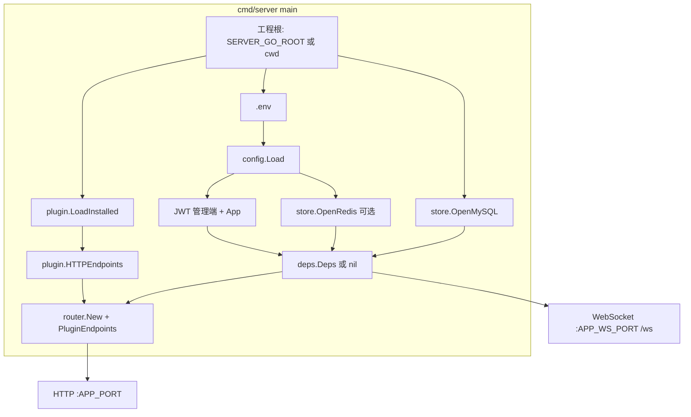

# 核心功能与架构

## 设计取向

| 维度 | 说明 |
|------|------|
| **JSON** | URL / Query / Body / 响应字段约定统一，**后台管理系统（管理端 `/admin/*`）**与 App 共用同一套契约。 |
| **路由** | 核心 [`router.Endpoint` + `Endpoints()`](../internal/app/router/endpoints.go)；插件 HTTP 由 **`plugin.HTTPEndpoints(loaded)`** 合并。挂载条件：**`install.lock` + 根 `config.go`** + [`plugin.go`](../plugin/plugin.go) 中 **`RegisterHTTPEndpoints`**。 |
| **鉴权** | `KindPublic` / `KindAdminJWT` / `KindAPIJWT`；管理端可叠 **`MenuPerm`**（对齐菜单 `name`）。 |
| **进程** | **单进程**：Gin → `APP_PORT`；**`net/http` + WS** → `APP_WS_PORT`，路径 **`/ws`**。 |
| **文档** | 无 Swagger；以 **`endpoints.go`**、middleware、handler 为准。 |

## 进程与依赖

- **MySQL**：**未配置 `DB_DATABASE`**（DSN 为空）时 `OpenMySQL` 返回 `nil`，**无 `Deps`**，仅 `/`、`/health`、静态等占位。**已配置但连接失败** → `main` **退出**，不会「无库启动」。
- **Redis**：失败时记录 `redis disabled`；黑名单、验证码、WS 映射等按路径降级。
- **JWT**：未配置 `JWT_API_SECRET` 时，`registerCoreRoutes` **跳过**所有 `KindAPIJWT` 路由；**管理端**未配置 `JWT_SECRET` 时 **`KindAdminJWT` 仍会注册**，中间件返回 `jwt not configured`（见 [鉴权](auth-and-permission.md)）。

## WebSocket

[`internal/websocket/server.go`](../internal/websocket/server.go) 在独立端口起服务，默认 **`/ws`**；`action` 分发到注册表；`login` 先校验管理端 JWT、再校验 App JWT，通过后写 Redis（键见 [`redis_contract.md`](../internal/websocket/redis_contract.md)）。

## 响应

HTTP JSON：`code`、`message`、`data`（无数据时常为 `{}`）。占位接口可用 `data._stub` 等调试字段。
