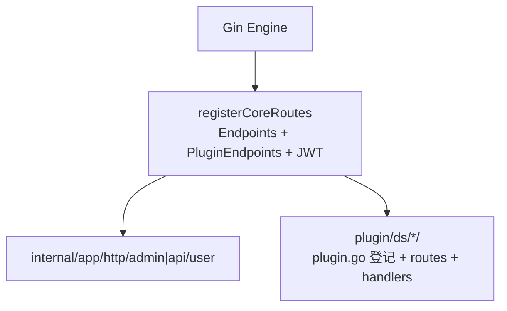
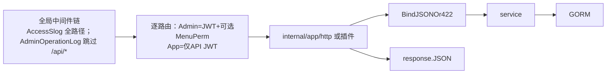

# 请求流程与扩展路径

## 核心路由与插件路由的边界

说明见 [路由](routing.md)。

## 请求链路（简图）

全局顺序与 **Admin / `/api/*` 差异**见 [中间件](middleware.md)；`BindJSONOr422` 详见 [验证器使用](validators.md)。

## 典型扩展路径

1. 若有可复用的领域逻辑，优先落在 [`internal/app/service`](../internal/app/service)（或插件目录内私有包），由 `internal/app/http` 或插件 handler 调用。
2. 在 [`internal/app/http`](../internal/app/http)（如 `admin/`、`api/user/`）实现 `Xxx(d *deps.Deps) gin.HandlerFunc`；入参校验见 [验证器使用](validators.md)（`tools.BindJSONOr422` 等）。
3. 在 `router.Endpoints()` 追加 `router.Endpoint`；**仅 `KindAdminJWT`** 需要且会使用 **`MenuPerm`**（与菜单 `name` 一致），**`KindAPIJWT` 不要设菜单权限**。
4. 若接口只属于某一插件、在 `plugin/ds/<插件>/src/http/routes.go` 的 **`Endpoints()`** 中追加 `router.Endpoint`；新插件须在 **[`plugin/plugin.go`](../plugin/plugin.go)** 中增加 **import + `init` 登记**；磁盘上需 **`config.go`** 与 **`install.lock`**（运行时挂载）。
