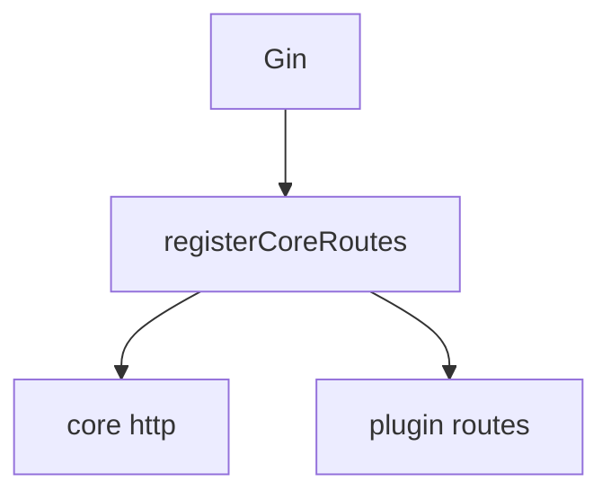
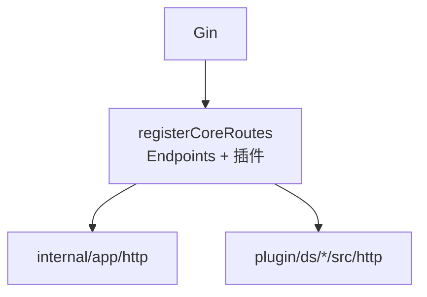
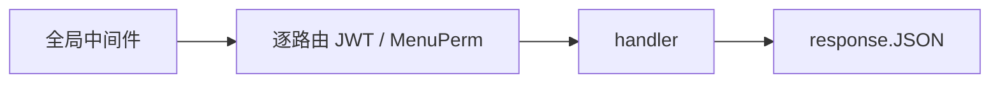

# HTTP：路由、分层、流程与约定

路由真源、Gin 中间件顺序、MVC 分层、统一 JSON、参数校验，集中在一篇。**插件合并**、**鉴权细节**另见 [插件](plugins.md)、[鉴权与权限](auth-and-permission.md)。

---

## 路由

**真源**：[`endpoints.go`](../internal/app/router/endpoints.go) + [`engine.go`](../internal/app/router/engine.go) **`registerCoreRoutes`**。

### 核心与插件

- **核心**：`Endpoint`（Method、Path、`Auth`、`MenuPerm`、`Handler`）。**`MenuPerm` 仅 `KindAdminJWT`** 生效。`Handler` 多为 `deps.Bind(d, …)`。
- **插件**：[`plugin.go`](../plugin/plugin.go) **`init`** 里 **`RegisterHTTPEndpoints(PluginName, src/http.Endpoints)`**；表在 **`src/http/routes.go`**。须 **`LoadInstalled`**（`install.lock` + `config.go`）且 **已在 `plugin.go` 登记** 才并入。

合并后：**公开**直挂 handler；**Admin** 加 JWT + 可选菜单权限；**API** 仅 JWT。

---

## MVC 与分层

**薄 Controller（Gin）+ Service + Model（GORM）**；路由为显式 **`[]router.Endpoint`**，无注解。

| 层 | 位置 | 职责 |
|----|------|------|
| 校验 | handler 内 [`BindJSONOr422`](../internal/app/common/tools.go) | `binding` 标签；失败 → 200 + `code=422`（见 [验证器](#validators)） |
| 全局校验钩子 | [`ValidatorHook`](../internal/app/middleware/validator.go) | 占位；业务勿依赖 |
| Handler | [`internal/app/http`](../internal/app/http)、插件 `src/http` | 参数、调 service、`response.JSON` |
| Service | [`internal/app/service`](../internal/app/service) | 无 Gin |
| Model | [`internal/app/model`](../internal/app/model) | GORM |

**依赖** → [Deps](deps.md)。**`JWTProvider`** 在 `internal/app/common`（`tools.Service`）。

---

## 中间件

与 [`engine.go`](../internal/app/router/engine.go) 一致。**管理端**与 **`/api/*`** 共用全局前置链。

- **`AccessSlog`**：全路径打点（含 `/api/*`）。
- **`AdminOperationLog`**：**整段 `/api/*` 跳过**（不写审计）；规则见 [可观测性](observability.md)。
- **逐路由 `MenuPerm`**：仅 **`KindAdminJWT`**。完整鉴权说明 → [鉴权与权限](auth-and-permission.md)。

### 全局顺序（先于 `registerCoreRoutes`）

1. `gin.Recovery`
2. `AdminOperationLog`（`/api/*` 直接 `Next`）
3. `RequestRouteContext`
4. `RequestHeader`（`X-Request-Id`）
5. `Translation`
6. `ValidatorHook`（当前占位 `c.Next()`）
7. `CORS`
8. `AccessSlog`

其后静态路由；**`cfg.Deps != nil`** 时 **`registerCoreRoutes`** 按 `Kind` 挂逐路由鉴权：

| `Kind` | 链 |
|--------|-----|
| `KindPublic` | handler |
| `KindAdminJWT` | `RequireAdminJWT` → 可选 `RequireAdminMenuPerm` → handler |
| `KindAPIJWT` | `RequireAPIJWT` → handler |

---

## 请求流程与扩展

### 路由边界

### 请求链（简）

### 扩展步骤

1. 可复用逻辑 → [`internal/app/service`](../internal/app/service)（或插件内包）。
2. 实现 `Xxx(d *deps.Deps) gin.HandlerFunc`；入参校验 → [验证器](#validators)。
3. 核心：在 **`Endpoints()`** 追加 `router.Endpoint`；**仅 `KindAdminJWT`** 使用 **`MenuPerm`**。
4. 插件：在 **`src/http/routes.go`** 的 **`Endpoints()`** 追加；新插件 → **[`plugin.go`](../plugin/plugin.go)** `import` + **`RegisterHTTPEndpoints`**；磁盘 **`config.go` + `install.lock`**。

---

## API 约定

HTTP JSON：**`code`**、**`message`**、**`data`**（[`response`](../internal/app/common/response)）。

### HTTP 状态码

多数业务 **HTTP 200**，由 **`code`** 表意。鉴权/校验也可能 **200 + code 401/422**（以中间件/handler 为准）。占位 → **`response.Stub`**（`data` 含 `_stub` 等）。

### 常用业务码

见 [`resultcode.go`](../internal/app/common/response/resultcode.go) / `result.go` 别名：

| 常量 | 值 | 含义 |
|------|---|------|
| `CodeSuccess` | 200 | 成功 |
| `CodeUnauthorized` | 401 | 未授权 |
| `CodeForbidden` | 403 | 无权限 |
| `CodeNotFound` | 404 | 不存在 |
| `CodeUnprocessable` | 422 | 参数校验失败 |
| `CodeDisabled` | 423 | 禁用 |
| `CodeFail` | 500 | 通用失败 |

`422` 的 i18n 键为 **`result.conflict`**（历史命名）。

### 构造与序列化

`response.OK` / `OKWithMessage` / `Fail` / `WithCode`；写入 **`response.JSON(c, httpStatus, r)`**。**`data` 键递归 snake_case**（[`snake.go`](../internal/app/common/response/snake.go)）。

### `message` 与 i18n

若 `message` 等于该 `code` 的 **内置英文默认**，`JSON` 会换成 **`i18n.T(…, ResultMessageKey(code))`**。自定义字符串通常不改。详见 [国际化](i18n.md)。

---

## 验证器

入口 **`tools.BindJSONOr422(c, &body)`**：成功返回 `true`；失败则**已写响应**（HTTP **200**、`code=422`、`message` 首条错误），须 **`return`**。

Gin 使用 **validator/v10**；struct 上写 **`binding:"required"`** 等与 `json` 并列。示例见 [`admin/routes.go`](../internal/app/http/admin/routes.go)。

错误文案由 [`validationFirstError`](../internal/app/common/tools.go) 生成（常见 tag 英文短句）；要 i18n 可扩展该函数。

---

**相关**：[鉴权与权限](auth-and-permission.md) · [插件](plugins.md) · [Deps](deps.md)
