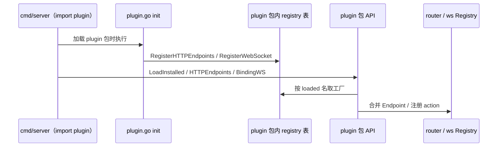

# 插件体系

目录约定：**仅允许** `plugin/{组织}/{插件名}/` 两级（如 `plugin/ds/sysConfig`），与 CLI、`LoadInstalled` 一致。插件在运行时的**逻辑名**即为该相对路径（如 `ds/sysConfig`），**不再使用根目录 `config.json`**；元数据（可选）写在根目录 **`config.go`** 的常量里。

## 依赖方向（强制）

**只允许单向：`fastapp/plugin` → 插件树（`plugin/{org}/{name}` 与 `.../src/**`）。**

- **`plugin/ds/**`（及任意插件包）禁止 `import "fastapp/plugin"`**，否则易形成 `plugin ↔ ds` 循环。
- **HTTP/WS 工厂登记**集中在 **[`plugin/plugin.go`](../plugin/plugin.go)** 的 **`init`**（及同包 [`registry.go`](../plugin/registry.go) 的全局表）；**不**在插件根写登记逻辑。
- 插件根 **`config.go`** 仅含 **`PluginName` / `Version` / `Description` / `PluginType` 等常量**（可选保留简短包注释），**无 `init`**、**不** import 宿主。

每个插件被 `LoadInstalled` 识别需同时具备：

- 根目录 **`config.go`**（仅元数据常量，见上）；
- 根目录 **`install.lock`**（由 **`plugin install`** 写入）。

根目录允许的**文件**（根级不允许随意堆杂文件）：**`config.go`**、**`install.lock`**、可选 **`readme.md`**、可选 **`publish.json`**（仅给 CLI **`plugin script`** 读顶层 **`publish`** 数组）。**Admin/API 的 Go handler** 仍在 **`src/http/`**，路由表在同级 **`routes.go`** 的 **`Endpoints()`**；**WS** 仍在 **`src/websocket/`**。

**编译期链入二进制**：在 **[`plugin/plugin.go`](../plugin/plugin.go)** 中为每个插件 **`import`** 其根包（取 **`PluginName` 常量**）与 **`src/http`** / **`src/websocket`**（取 **`Endpoints` / `RegisterWebSocket`**），并在 **`init`** 内调用 **`RegisterHTTPEndpoints`** / **`RegisterWebSocket`**（见同文件）。**[`cmd/server/main.go`](../cmd/server/main.go)** 仍仅 **`import fastapp/plugin`**。

Go **不能**在运行时按目录自动 `import`；编译期必须在某处维护「要链进二进制的插件」列表，本仓库将该列表放在 **`plugin.go` 的 import + `init`**，**[`cmd/server/main.go`](../cmd/server/main.go)** 仅 **`import fastapp/plugin`** 即可。

**是否挂载路由（运行期）**：仍仅由 **[`LoadInstalled`](../plugin/plugin.go)** 决定——磁盘上同时存在 **`install.lock`** 与 **`config.go`** 的插件才会进入 **`loaded`**，**[`HTTPEndpoints`](../plugin/plugin.go) / [`BindingWS`](../plugin/plugin.go)** 只合并 **`loaded`**。若 **`plugin.go` 未为该插件写登记**，则即使 **`install.lock` 存在** 也不会挂路由。

**新增插件**：除 **`config.go`**、`src/**` 实现外，须在 **`plugin.go`** 的 **`import` + `init`** 中增加对应登记并重新编译。

**安装、列表、卸载、脚手架、同步 admin、publish** 等命令见 **[命令行（CLI）](cli.md#plugin--插件)**。

---

## 加载与运行流程（机制说明）

### 时序（`cmd/server`）

1. **编译期 / 包加载**：**[`plugin/plugin.go`](../plugin/plugin.go)** 与其它所 import 包加载时，**`init`** 调用 **`RegisterHTTPEndpoints` / `RegisterWebSocket`**，把「名称 → 工厂」写入 **`registry.go`** 内全局表。
2. **`main` 执行**：[`LoadInstalled`](../plugin/plugin.go) 扫磁盘，得到**已安装**插件列表 **`[]Info`**（同时存在 **`install.lock`** 与 **`config.go`** 的目录；插件名为相对路径 `org/plugin`）。随后 **`LoadPluginI18n`** 合并带 **`src/locales`** 的文案（规则与 `install.lock` 不完全相同，见下文）。
3. **HTTP**：若 DB 可用，**[`HTTPEndpoints(loaded)`](../plugin/plugin.go)** 按 **`loaded` 的顺序**依次取出已注册工厂并 **`append`** 路由切片，再交给 [`router.New`](../internal/app/router/engine.go) 与核心路由合并。
4. **WebSocket**：**[`BindingWS(loaded)`](../plugin/plugin.go)** 同样按 **`loaded` 顺序**依次调用各插件登记的 `RegisterWebSocket` 回调，填充 **`ActionRegistry`**，再交给 [`websocket.ListenAndServe`](../internal/websocket/server.go)。

### 是否合理

| 方面 | 评价 |
|------|------|
| **安装边界** | 用 **`install.lock`** 区分「磁盘上有代码」与「本环境已安装」，路由只合并已安装插件，避免误挂载未装库，**合理**。 |
| **显式登记** | 列表集中在 **`plugin.go` 的 import + init`**；**插件根不写登记**，依赖方向清晰，**无** `plugin ↔ ds` 循环。 |
| **注册与启用的分离** | **`init` 已向宿主表登记**；**`HTTPEndpoints` / `BindingWS` 仅按 `LoadInstalled`（已安装）** 取工厂。未安装 → 无对外路由；已安装但 **未在 `plugin.go` 中登记** → 无路由。 |
| **运维约束** | **新插件**：须在 **`plugin.go`** 增加 import 与 **`init` 登记**；漏加则 **`install.lock` 无法挂路由**。 |
| **顺序** | **`loaded`** 顺序来自 **`LoadInstalled`** 对目录的遍历（`org` → 其下插件名），**不是** `install.lock` 内自定义顺序。若将来需要严格安装序，需改 `LoadInstalled` 或增加排序字段；当前实现 **对多数场景可接受**。 |
| **i18n** | **`LoadPluginI18n`** 按「存在 **`config.go`**」扫描，**不要求** `install.lock`。开发期未装插件也可合并文案；与 HTTP 仅挂已装插件略有不同，**可按团队偏好视为特性或以后对齐**。 |
| **编译体积** | **`plugin.go` import 的插件实现** 会 **整包链入二进制**；**未安装**仅运行时 **`LoadInstalled`** 不挂路由。若要按环境裁剪可改 import 或 build tags。 |

### 子包如何保持「代码在子包、登记在宿主」且尽量简单

- **HTTP**：逻辑在 **`src/http/*.go`**；路由表集中在 **`routes.go`** 的 **`Endpoints()`**（及 **`ep()`** 小助手）。**[`plugin.go`](../plugin/plugin.go)** 的 **`init`** 增加一行 **`RegisterHTTPEndpoints(插件根.PluginName, 子http.Endpoints)`**。
- **WebSocket**：逻辑在 **`src/websocket/*.go`**；**`ActionRegistry` 的 `Register` / `RegisterVisitor` / `AddZeroConnHook`** 放在 **`register_ws.go`**（或同类单一文件）的 **`RegisterWebSocket(reg)`** 内，用**同包闭包**调未导出 **`handle*`**。**[`plugin.go`](../plugin/plugin.go)** **`init`** 增加 **`RegisterWebSocket(插件根.PluginName, ws.RegisterWebSocket)`**。
- **不要在 `websocket` 包内写 `init` 调宿主登记函数**，也不要在插件根 **`config.go`** 写登记（根文件仅常量）。

## 根目录：`config.go`

| 内容 | 说明 |
|------|------|
| **常量** | 如 `PluginName`（须与目录 `ds/xxx` 一致）、`Version`、`Description` 等。 |
| **禁止** | `init`、`import fastapp/plugin`、对 **`RegisterHTTPEndpoints`** 的调用（登记仅在 **`plugin/plugin.go`**）。 |

## Go 侧 HTTP：`plugin/ds/<插件>/src/http/`

| 文件 | 说明 |
|------|------|
| **`routes.go`** | **`Endpoints() []router.Endpoint`**、**`ep(fn)`**；集中声明路由表。 |
| **其它 `*.go`** | 管理端与 App API handler（`func(*deps.HandlerCtx)`）；与 **`routes.go`** **同 package**；model 引用 **`../model`** 即 `.../src/model`。 |

## 管理端菜单 `menu.name`（与 `MenuPerm`、`plugin uninstall`）

约定与 **[`pluginMenuNamePrefix`](../internal/cli/migrate_cmd.go)**（`plugin uninstall` 内调用）一致，保证**种子菜单**、**路由 `MenuPerm`**、**卸载清理**三者对齐。

| 规则 | 说明 |
|------|------|
| **插件前缀** | 插件逻辑路径 `org/plugin`（与目录、`config.go` 的 **`PluginName`**、`plugin install|uninstall` 参数一致，**段内大小写与磁盘相同**）把 **`/`** 换成 **`:`**，得到前缀。例：`ds/sysCms` → **`ds:sysCms`**。 |
| **卸载逻辑** | 先按 **`menu.name LIKE '{前缀}%'`** 删除 **`role_belongs_menu`** 中关联行，再删除 **`menu`** 行；随后按 **`database/migrations`** 解析结果逆序 **`DROP TABLE`**，见 [`deletePluginMenusByPrefix` / `RunDatabaseUninstallSQL`](../internal/cli/migrate_cmd.go)。 |
| **路由** | 管理端 **`Endpoint.MenuPerm`** 必须与对应菜单行的 **`menu.name`** 完全相同（见 [鉴权与权限 · MenuPerm](auth-and-permission.md#菜单权限-menuperm)）。 |
| **手工维护** | **`database/seeders/*_menu.sql`**（或其它写入 `menu` 的 SQL）里，凡属于本插件的 **`name`** 均须以上述**前缀**开头；若使用另一大小写（如 `ds:syskefu` 与路径 `ds/sysKefu`），**`plugin uninstall` 不会删除**这些菜单。 |

**`gen crud --plugin=org/plugin`**（见 [代码生成器 · 插件菜单](code-generator.md#gen-crud-plugin-menu)）时：**`PermPrefix` = `{前缀}:{资源 snake}`**（资源一般为表对应 struct 的 snake_case）；生成的菜单子项与路由片段为 **`:list`**、**`:create`**、**`:save`**、**`:delete`**，与 **[`menu.sql.tmpl`](../internal/cli/templates/crud/menu.sql.tmpl)**、**`gen/crud/snippets/*_endpoints.txt`** 一致，合并前请核对与现有 `*_menu.sql` 是否冲突。

## WebSocket

在 **`plugin/ds/<插件>/src/websocket/`**（如 `package ws`）内实现业务处理函数，并提供一个 **`RegisterWebSocket(reg *websocket.ActionRegistry)`**（或同名导出函数），在同包内向 **`ActionRegistry`** 写完 **`Register` / `RegisterVisitor` / `AddZeroConnHook`**。**[`plugin.go`](../plugin/plugin.go)** 的 **`init`** 中 **`RegisterWebSocket(PluginName, ws.RegisterWebSocket)`**（**`PluginName`** 与插件根常量一致，见 [`register_ws.go`](../plugin/ds/sysKefu/src/websocket/register_ws.go)）。[`plugin.BindingWS`](../plugin/plugin.go) 按 **`LoadInstalled` 返回顺序**（目录扫描顺序）依次组装 **`ActionRegistry`**。

## 数据库：migrations / 卸载 / seeders

**核心库** **`internal/store/database`** 与**插件** **`plugin/<组织>/<插件>/database`** 均使用子目录 **`migrations/`**、**`seeders/`**。

- **`plugin uninstall`**（CLI）会：**菜单**按 [菜单 name 约定](#plugin-menu-names) 的前缀规则 **`LIKE` 清理**；再扫描 **`database/migrations/*.sql`** 中带反引号的 **`CREATE TABLE`**（**`{{prefix}}`** 先替换为 **`DB_PREFIX`**），汇总表名后按与安装时 **相反** 顺序执行 **`DROP TABLE IF EXISTS`**（**`FOREIGN_KEY_CHECKS=0`**），最后删除 **`install.lock`**。
- **`plugin install`**：要求根目录已存在 **`config.go`**；对该插件 **migrations → seeders** 后写入 **`install.lock`**。单独执行 SQL 可用 **`migrate up` / `migrate seed`**（插件目录填 **`plugin/.../database`**），见 [CLI · migrate](cli.md#migrate)。
- SQL 中 **`{{prefix}}`** 在执行迁移 / **`plugin uninstall` 解析表名** 时替换为 **`DB_PREFIX`**（见上条）。

**插件 `database/seeders/`**：目录下 **`*.sql`** 按**文件名升序**执行。建议命名为 **`YYYY_MM_DD_menu.sql`**（菜单）、**`YYYY_MM_DD_config.sql`**（**凡写入 `system_config`、`system_config_group` 的种子均归此文件，勿放入 `_data`**；插入前须按 **`code`** / **`(group_code,key)`** 做 **`NOT EXISTS`**，已存在则跳过，避免重复跑 seeders 覆盖后台已改配置）、**`YYYY_MM_DD_data.sql`**（其余业务表数据）。同一插件需在同一天跑多份同类种子时，可用**不同日期前缀**区分以控制顺序（例如 sysCms 在 **`2025_12_26_data.sql`** 与 **`2025_12_27_data.sql`** 拆分）。

## 与核心路由的关系

合并挂载与 **注册表** 说明见 [路由](routing.md)。
