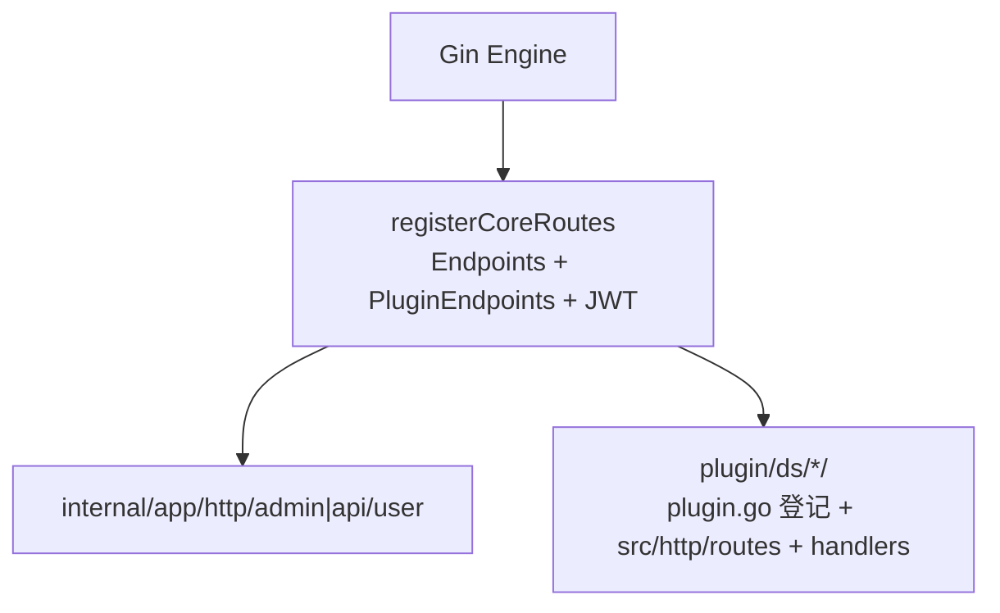

# 路由

已挂载路由以 [`internal/app/router/endpoints.go`](../internal/app/router/endpoints.go) 为准（[`engine.go`](../internal/app/router/engine.go) 内 `registerCoreRoutes`）。

## 核心表与插件表合并

- **核心表** [`internal/app/router/endpoints.go`](../internal/app/router/endpoints.go)（同文件顶部为 `Kind`/`Endpoint`）：`Endpoint` 描述 Method、Path、`Auth`（`Kind`）、可选 `MenuPerm`、`Handler`（指向 `func(*deps.Deps) gin.HandlerFunc` 工厂，通常内层为 `deps.Bind(d, handlerCtxFn)`）。**`MenuPerm` 仅对 `KindAdminJWT` 生效**；`KindPublic` / `KindAPIJWT` 应留空。[`engine.go`](../internal/app/router/engine.go) 内 `registerCoreRoutes` 合并后按 `Kind` 拼中间件：**公开** 直连 handler；**Admin JWT** 为 `RequireAdminJWT` + 可选 `RequireAdminMenuPerm`；**API JWT** 为 `RequireAPIJWT`（无菜单权限）。
- **插件 HTTP**：**[`plugin/plugin.go`](../plugin/plugin.go)** 的 **`init`** 中 **`RegisterHTTPEndpoints(插件根.PluginName, src/http.Endpoints)`**，路由表在 **`src/http/routes.go`** 的 **`Endpoints()`**。**仅当** `LoadInstalled` 命中（**`install.lock` + 根 `config.go`**）且该插件已在 **`plugin.go`** 中写好上述登记时，路由才会被 **`plugin.HTTPEndpoints(loaded)`** 合并。**新增插件**：须在 **`plugin.go`** 增加 **import + `init` 登记** 并重新编译。

## 与 Gin 的关系

插件目录与 CLI 约定见 [插件](plugins.md)。
